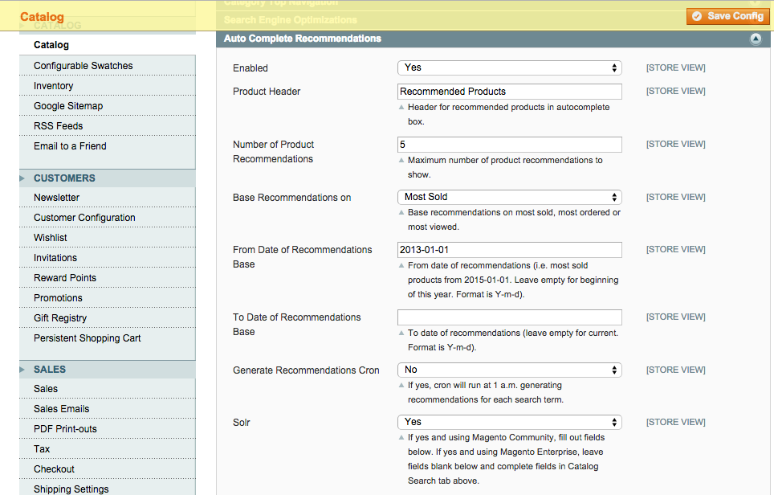

AutoComplete Recommendations
============================
Show recommended products and images in the search autocomplete suggestions box.

Description
-----------
Show recommended products and images in the search autocomplete suggestions box. 
Recommendations can be based on most order, most sold or most viewed. 
Recommendations can also be selected for each search term. Also has built-in 
support for Solr to get suggestions. 

How to use
----------

Upload the extension files to your server. In the admin, under 
System -> Configuration -> Catalog -> Catalog -> Auto Complete Recommendations,
configure the extension:

On the front end, after a search term has been added to the results database, 
recommendations will start to appear for the search term:

You can also select specific recommendations for a search term. Go to Catalog ->
Search Terms:

and add Recommended Products:

